# Lab 3: Estimate monthly Copilot Credit consumption for Microsoft Copilot Studio
Estimate monthly Copilot Credit consumption for Microsoft Copilot Studio and Dynamics 365 agents before you commit to a rollout.

| **Duration** | **Cost** |
| --- | --- |
| 30 minutes | Free (no license needed) |

# Overview

In Microsoft Copilot Studio, agent usage is measured in **Copilot
Credits**. Consumption varies widely depending on how an agent is
designed and how often people interact with it. The **Copilot Credit
Estimator** is a free, transparent tool that forecasts monthly credit
volume so you can plan a budget before you buy.

**In this lab you will:** open the estimator, configure a realistic
agent, model low, medium, and high-volume scenarios, add a variance
buffer, and export a PDF for stakeholder review.

> **What the estimator is — and is not**
>
> **✅ Use it for:** Budget planning, comparing configurations, understanding feature cost drivers, and generating a PDF for procurement.
>
> **❌ Do not use it as:** A binding price quote, a guaranteed forecast, or a replacement for official Microsoft pricing. It provides forward-looking estimates only.
Rate reference used throughout: **1 Copilot Credit = $0.01 USD**. Rates
are subject to change; always confirm against your current licensing
agreement.

**Prerequisites**

Before you start, gather the following. The tool only produces
meaningful output when your assumptions reflect real-world use.

- **A web browser.** No sign-in or license is required to use the
  estimator.

- **A target use case.** Pick one agent to model first (for example, an
  internal HR helpdesk or an AP vendor-inquiry agent).

- **Historical volume data (3–6 months).** Approximate monthly user
  count and how often each user interacts.

- **Agent design details.** Which knowledge sources it uses, whether it
  uses tenant graph grounding, its orchestration style, and any tools or
  flows it calls.

- **M365 Copilot license counts.** Users who already hold a Microsoft
  365 Copilot license can offset some credit consumption.

# Key concepts: what drives consumption

Credit consumption is driven by five levers. Understanding these makes
your estimates defensible to both technical and finance stakeholders.

| **Driver** | **What it means for your estimate** |
| --- | --- |
| **Agent type** | Custom B2E/B2C agents versus specialized Dynamics 365 agents (Sales, Service, Finance, Supply Chain). Each has its own calculation structure. |
| **Traffic** | Number of users × interaction frequency per month. The single biggest lever — get this right first. |
| **Knowledge** | Responses grounded in knowledge sources. Tenant graph grounding (assumes Enhanced Search) and non-tenant grounding (Dataverse, web, files) each carry different rates. |
| **Orchestration** | Classic keyword triggers versus generative orchestration (AI chooses the response path). Generative orchestration consumes more. |
| **Tools and flows** | Actions and automated flows the agent invokes add incremental consumption on top of the base response. |

**Offset:** Credits are negated for users who already hold Microsoft 365
Copilot licenses — be sure to enter those counts to avoid
over-estimating.

# Lab exercise

## Exercise 1 — Open the estimator

1.  In your browser, go to the Copilot Credit Estimator:
    [*https://microsoft.github.io/copilot-studio-estimator/*](https://microsoft.github.io/copilot-studio-estimator/)

- The tool loads instantly — no sign-in required.

    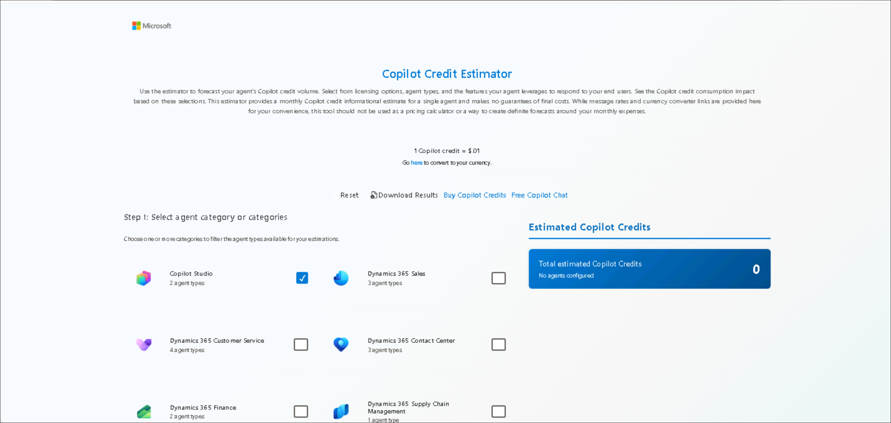

 Step 2 Add your agent or agents is enabled or seen only after your
 select the agent catagory
  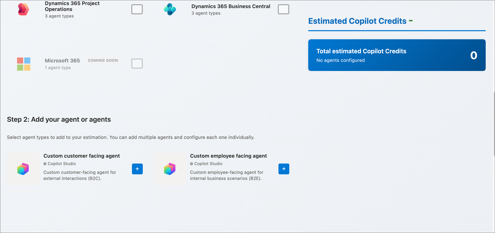

## Exercise 2 — Walk through the estimator window

Before entering any data, take a moment to understand the layout.
Knowing where each control sits makes the rest of the lab faster and
helps you interpret the live results as you type.

1.  Note the two-panel layout: agent selection and configuration on the
    left, and a live results panel on the right that updates as you make
    changes.

Orient yourself to the main regions of the window:

2.  **Top toolbar.** Holds the Reset, Download Results, Buy Copilot
    Credits, and Free Copilot Chat controls, plus the currency converter
    link.

    

- **Rate reference.** Displayed near the top: 1 Copilot Credit = $0.01
  USD. Use the “Go here to convert to your currency” link for non-USD
  estimates.

  

- **Left panel — configuration.** Where you select products, add agents,
  and enter traffic, knowledge, tools, and flow assumptions.

  

- **Right panel — results (read-only).** Shows the Total Estimated
  Copilot Credits and the per-bucket breakdown (knowledge, agent tools,
  agent flows). It recalculates automatically.

  

- **Two-step flow.** Step 1: select your product(s). Step 2: add and
  configure your agent(s). The results panel stays visible throughout.

  

  

> **Tip:**
> Nothing you enter is saved to Microsoft or requires a sign-in. The estimator runs entirely in your browser, so you can experiment freely and reset at any time using the **Reset** control in the top toolbar.

## Exercise 3 — Select an agent category and type

> **Disclaimer**
>
> Microsoft 365 is currently marked **“Coming Soon”** in the Copilot Credit Estimator and is not yet available for selection. This lab therefore uses **Copilot Studio agents** — **Custom customer-facing agent** and **Custom employee-facing agent** — as the working examples.
>
> When Microsoft 365 becomes available, the same two-step process will apply:
>
> 1. **Step 1:** Select your products.
> 2. **Step 2:** Add your agents.
>
> The workflow is expected to remain unchanged, with only new **Microsoft 365 Copilot agent types** becoming available for selection.

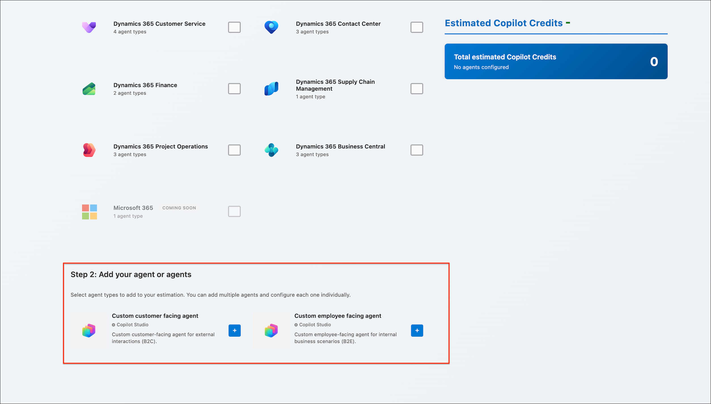

1.  Choose one or more categories to filter the available agents:
    Copilot Studio Custom, Dynamics 365 Sales, Service, Finance, Supply
    Chain Management, or Microsoft 365.

    

    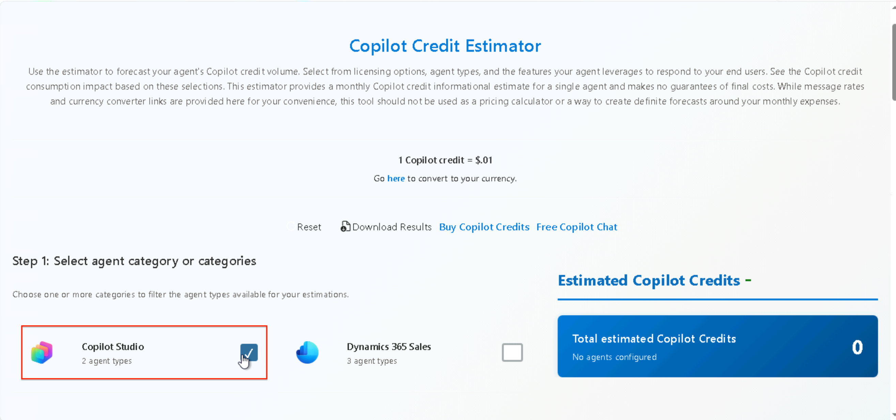

2.  Scroll down and select the **+** button on an agent card to add it.
    For this lab, add a **Copilot Studio Custom (B2E)** employee-facing
    agent.

    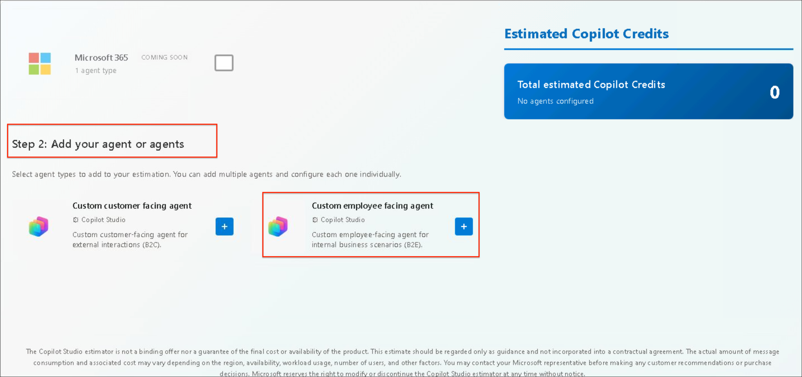

    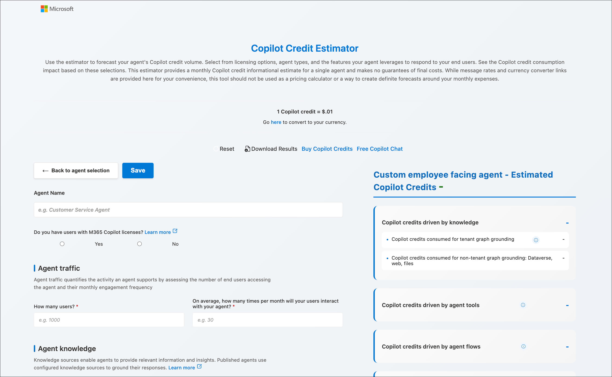

**Copilot Credit Estimator calculator window opens:** this is the
calculator that estimates how many Copilot Credits your custom agent
will consume per month. The steps below explain how to complete each
field.

### Right panel — the read-only output

The right side auto-calculates as you fill in the left. It breaks the
estimate into three cost buckets:

- **Credits driven by knowledge** — tenant graph grounding versus
  non-tenant grounding (Dataverse, web, files).

- **Credits driven by agent tools** — connector/MCP and API invocations.

- **Credits driven by agent flows** — automated flow runs.

Each bucket expands (click the –/+) to show the breakdown. The dashes
stay as “-” until you complete the required (\*) fields.

## Exercise 4 — Quantify expected traffic

### Steps to finish the configuration

1.  Fill **Agent Name**.

2.  Choose **Yes/No** for licenses.

3.  Enter **users** and **interactions/month**.

4.  Scroll down and complete **% from knowledge** and any tools or flows
    fields.

5.  Watch the right panel populate the credit estimate.

6.  Click **Save** (top left) to store the estimate.

**Note:** The estimator's credit-to-cost conversion and the exact
license allowances change over time, so treat the output as a planning
estimate rather than a billing guarantee.

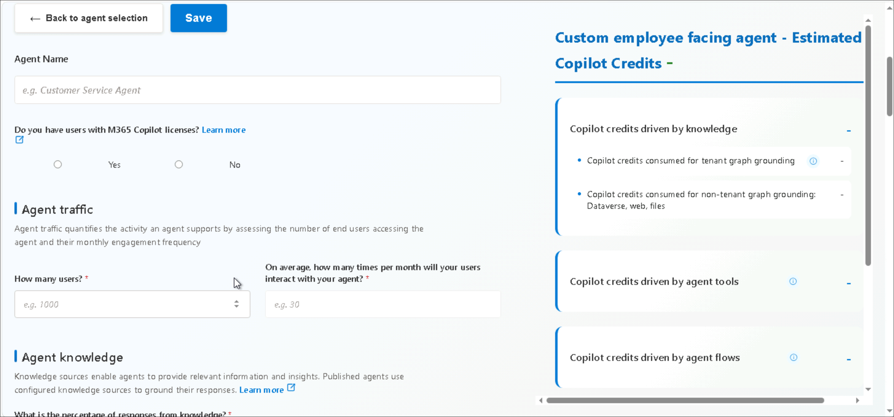

### Agent configuration

1.  **Agent Name** — enter a descriptive name, for example **HR Helpdesk
    Agent**. This is just a label for the estimate.

    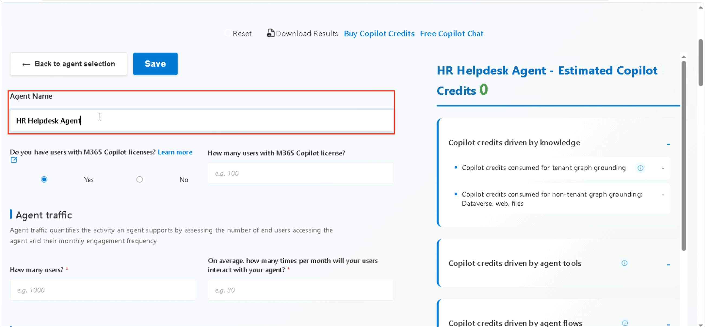

2.  **Do you have users with M365 Copilot licenses?** Select **Yes** or
    **No**. This matters for cost:

    - **Yes** — licensed users get a base allotment of activity
      included, so some usage won't draw from the credit pool.

    - **No** — all consumption is billed as metered Copilot Credits
      (pay-as-you-go).

3.  **How many users hold a Copilot license?** For example, 100 users.

Pick the option that matches your actual user base. If it's mixed, the
estimator generally asks whether the agent's audience holds licenses.

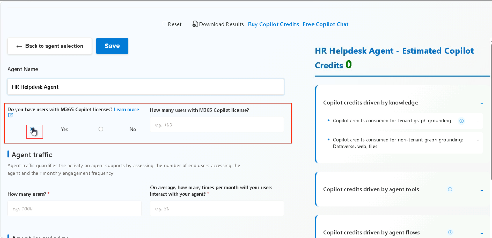

## Exercise 5 — Configure knowledge, orchestration, and tools

### Agent traffic

**How many users?** Total number of end users who will access this agent
per month (for example, 1,000).

**On average, how many times per month will your users interact with
your agent?** Average sessions per user per month (for example, 30).
Users × interactions = total monthly interactions, the main driver of
the estimate.

### Agent knowledge

**What is the percentage of responses from knowledge?** Estimate what
share of responses will pull from configured knowledge sources
(SharePoint, Dataverse, web, files). Grounding consumes credits, so a
higher percentage raises the estimate. If your agent answers mostly from
live tool or MCP calls rather than indexed knowledge, this value will be
lower.

- **Percentage of responses from knowledge:** 50

- **Of those, percentage using tenant graph grounding:** 10

  

### Worked example — knowledge credit calculation

The calculation below shows exactly how the estimator reaches 45,000
knowledge credits from the inputs above.

> **INPUTS**
>
> Users: **1,000**  
> Interactions per user/month: **30**  
> Responses from knowledge: **50%**  
> Tenant graph grounding: **10%** *(all other grounding = 90%)*
>
> **STEP 1 — Total monthly interactions**
>
> `1,000 users × 30 = 30,000 interactions/month`
>
> **STEP 2 — Responses that use knowledge**
>
> `30,000 × 50% = 15,000 knowledge-grounded responses`
>
> **STEP 3 — Split into grounding types**
>
> **Tenant graph grounding (10%)**
>
> `15,000 × 10% = 1,500 responses`  
> `1,500 × 12 credits = 18,000 credits`
>
> **Non-tenant grounding (90%)**
>
> `15,000 × 90% = 13,500 responses`  
> `13,500 × 2 credits = 27,000 credits`
>
> **STEP 4 — Total knowledge credits**
>
> **18,000 + 27,000 = 45,000 credits**

> **Key insight**
>
> Tenant graph grounding costs roughly **6× more per response** than non-tenant grounding. That is why **1,500 tenant-grounded responses cost 18,000 credits**, while **13,500 non-tenant responses cost only 27,000 credits**.
>
> The two levers that have the greatest impact on this total are:
>
> - The **percentage of responses that use knowledge**
> - The **percentage of responses that use tenant graph grounding**

### Agent tools/actions

Fill in only the row that matches what you actually configured. For the
HR Helpdesk agent, that is **Model Context Protocol**.

| **Tool type** | **How many tools configured?** | **How often invoked per interaction?** |
| --- | --- | --- |
| Prompt | *(leave blank)* | *(leave blank)* |
| Agent flow | *(leave blank)* | *(leave blank)* |
| Computer use | *(leave blank)* | *(leave blank)* |
| Custom connector | *(leave blank)* | *(leave blank)* |
| **Model Context Protocol** | **1** | **0.01** |
| REST API | *(leave blank)* | *(leave blank)* |

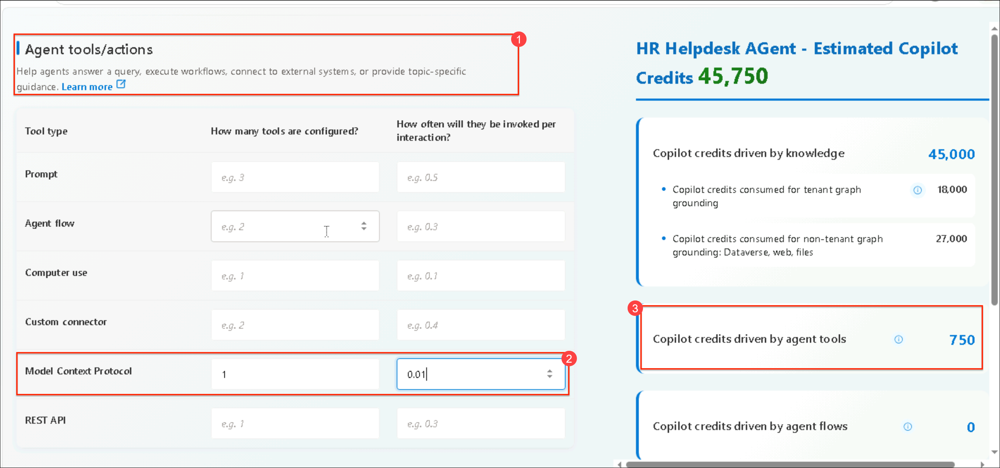

**Note:** an invocation rate of 0.01 means the MCP connector fires on
only 1 out of every 100 interactions.

### How the agent tools bucket is calculated

The estimator reaches 750 agent-tool credits, and a new total of 45,750,
as follows.

> **MCP INPUTS**
>
> Tools configured: **1**  
> Invocations per interaction: **0.01**
>
> **CALCULATION**
>
> Total interactions: `1,000 × 30 = 30,000`  
> MCP invocations: `30,000 × 0.01 × 1 = 300`  
> Credits: `300 × 2.5 = 750 credits`
>
> **NEW TOTAL**
>
> Knowledge: **45,000 credits**  
> Agent tools: **750 credits**  
> Agent flows: **0 credits**
>
> **Total: 45,750 credits**

### Agent flows

No Power Automate-style flows are defined for this agent, so:

- **How many agent flows configured?** 0 (or leave blank).

- **Average actions per flow?** Leave blank.

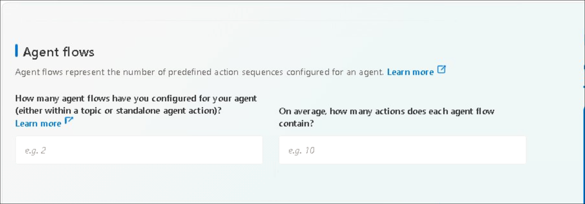

### Agent optional modifiers (prompt model types)

These count custom AI-prompt actions using specific model tiers. This
agent uses the standard Copilot model to talk to the MCP connector, with
no separate Basic, Standard, or Premium prompt actions, so:

- **Basic** → leave blank

- **Standard** → leave blank

- **Premium** → leave blank

Leave all three empty unless you have explicitly built custom prompt
tools into the agent.

  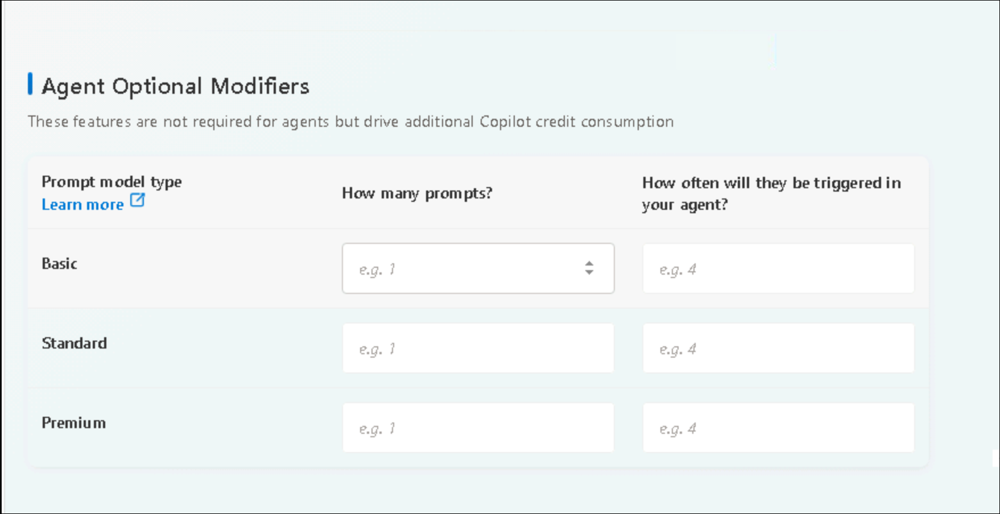

## Exercise 6 — Review the results panel and save

1.  Scroll up and click **Save** to store the HR Helpdesk agent
    configuration for future reference.

    

The total credit estimate for the HR Helpdesk agent is stored in the
right panel.

  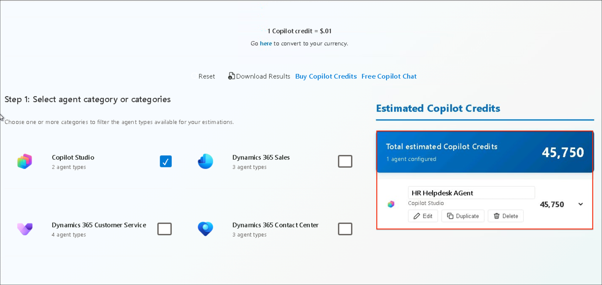

You can edit, delete, or duplicate the saved agent configuration at any
time.

## Exercise 7 — Download and export the results

Once your estimate is complete, capture it as a file so you can share it
with stakeholders and attach it to a budget request. The estimator
produces a shareable output directly from the top toolbar.

1.  **Confirm your agents and totals.** Check that every agent you
    intend to include is listed and that the Total Estimated Copilot
    Credits value in the right panel reflects your final assumptions.

2.  In the top toolbar, select **Download Results**. The estimator
    generates a PDF summarizing your selected products, configured
    agents, per-bucket credit breakdown, and the total estimate.

    

3.  Save the file with a descriptive name, for example
    **Copilot-Credit-Estimate_HR-Helpdesk_YYYY-MM.pdf**, so future
    revisions are easy to track.

    

    

    

    

4.  **Distribute for review.** Share the PDF with finance and
    procurement stakeholders as the supporting document for your credit
    purchase.

> **Note**
>
> The exported PDF is a **forward-looking planning estimate**, not a binding quote. Regenerate and re-export it whenever your traffic assumptions or agent configuration change, and confirm current rates against your licensing agreement before making a purchase.

# Scenario bracketing — estimating table

This table demonstrates a budgeting technique called **scenario
bracketing** — estimating a range rather than betting on a single
number, then padding it with a safety buffer. Here's what each part
shows: Model low, medium, and high scenarios

The figures below are placeholders to show the shape of a completed
estimate — your own numbers come from the live tool. They illustrate how
bracketing plus a buffer produces a defensible budget range.

| **Scenario** | **Users** | **Credits / mo** | **Est. USD** |
| --- | ---: | ---: | ---: |
| Launch (low) | 150 | 18,000 | $180 |
| Steady state (medium) | 400 | 52,000 | $520 |
| Peak / seasonal (high) | 650 | 91,000 | $910 |
| **Budget = medium + 20%** | — | **62,400** | **$624** |

## Exercise 8 — Explore estimates across multiple categories (try it yourself)

So far you have modeled a single Copilot Studio agent. In practice, most
organizations run several agents across different product categories at
once — for example, a Copilot Studio helpdesk agent alongside Dynamics
365 Sales and Service agents. The estimator is built for this: you can
add multiple agents, configure each one individually, and the right
panel aggregates them into a single organizational total.

> **Why this matters**
>
> Aggregating agents across departments or business units gives finance **one combined credit total** to budget against, instead of a scattered set of per-team estimates. It also helps you identify **which category is the largest cost driver** before committing to a rollout.

### Try it yourself

Work through the following on your own in the live estimator. There is
no single correct answer — the goal is to see how the combined total
responds as you add and vary agents across categories.

1.  **In Step 1, select more than one category.** For example, tick both
    Copilot Studio and Dynamics 365 Sales so their agent types appear in
    Step 2.

2.  **Add one agent from each category.** Use the + button to add, for
    instance, a Copilot Studio Custom (B2E) agent and a Dynamics 365
    Sales agent to the same estimate.

3.  **Configure each agent individually.** Give each its own traffic,
    knowledge, tools, and flow assumptions — they do not have to match.
    Each agent keeps its own configuration card.

4.  **Watch the combined total.** The right panel now shows the
    aggregated Total Estimated Copilot Credits across every agent you
    added, plus a per-agent breakdown you can expand.

5.  **Experiment.** Add a third agent, change one agent's user count, or
    remove a category, and observe how the total shifts. Note which
    agent contributes the most credits.

Questions to reflect on as you try it:

- Which category or agent is your single biggest cost driver, and why?

- If you doubled the users on the smallest agent, would it change the
  ranking?

- How does the combined total compare to the sum you would have guessed
  for each agent separately?

> **Tip**
>
> Because the estimator runs entirely in your browser and saves nothing, you can **add, duplicate, and delete agents freely**. Use the **Reset** control to clear everything and start a fresh multi-agent scenario whenever you like.

# Best practices

| **✅ Do** | **❌ Don't** |
| --- | --- |
| Base volumes on 3–6 months of historical data. | Use aspirational volumes without validation. |
| Test low, medium, and high scenarios to bracket cost. | Assume 100% feature adoption on day one. |
| Add a 10–20% buffer for variance. | Ignore seasonal surges (holiday support, quarter-end). |
| Update estimates quarterly and involve real end users. | Treat the estimate as a guaranteed pricing quote. |

# After you buy: monitor actual versus estimated

Forecasting is only half the loop. Once agents are live, compare real
consumption against your estimate and revisit assumptions after the
pilot.

- **Where to monitor:** the Microsoft 365 admin center billing and usage
  reports, and the Power Platform admin center under Licensing for
  daily, per-agent visibility.

- **Set alerts:** configure consumption thresholds so you are warned
  before you approach your limit.

- **If you run out:** agents stop processing until you purchase more
  credits — which is exactly why the buffer matters.

- **Purchasing:** the estimator's Buy Copilot Credits link opens the
  M365 purchasing page (SKU CFQ7TTC0LH1F). Confirm whether your credits
  roll over or are use-it-or-lose-it monthly allocations.

# Completion checklist

- Opened the estimator and selected an agent category and type.

- Entered validated traffic (users × frequency) from historical data.

- Configured knowledge, orchestration, tools, and M365 license offsets.

- Modeled low, medium, and high scenarios and recorded the deltas.

- Applied a 10–20% buffer and exported a PDF for stakeholders.

- Identified where you will monitor actual consumption post-purchase.

# References

[*Copilot Credit Estimator
tool*](https://microsoft.github.io/copilot-studio-estimator/)

[*Microsoft Learn — Agent usage
estimator*](https://learn.microsoft.com/en-us/microsoft-copilot-studio/agent-usage-estimator)

[*Microsoft Learn — Billing rates and
management*](https://learn.microsoft.com/en-us/microsoft-copilot-studio/requirements-messages-management)
