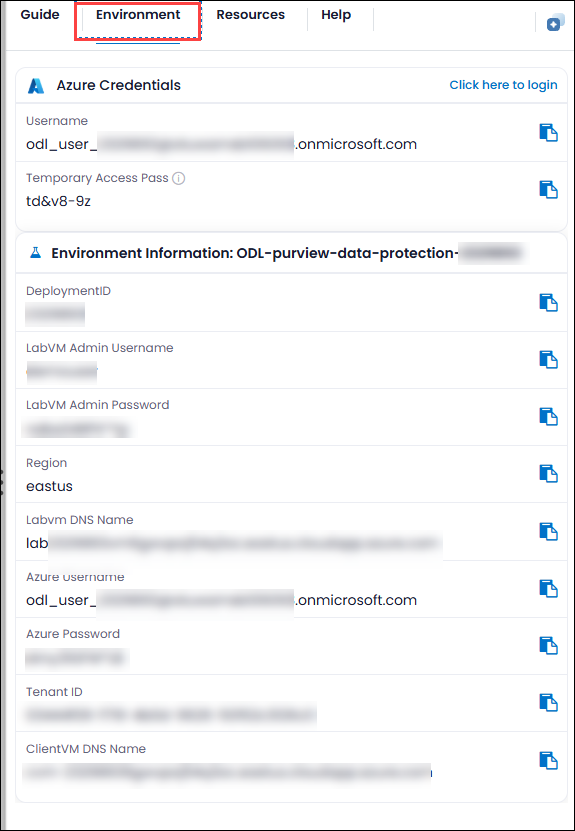
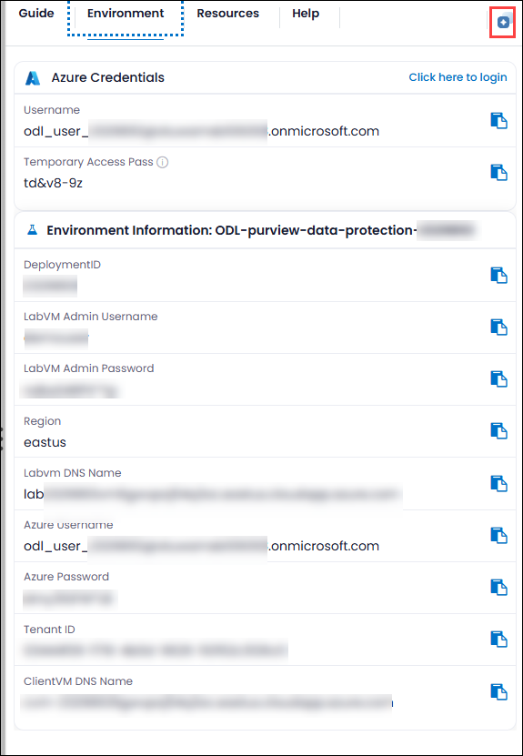
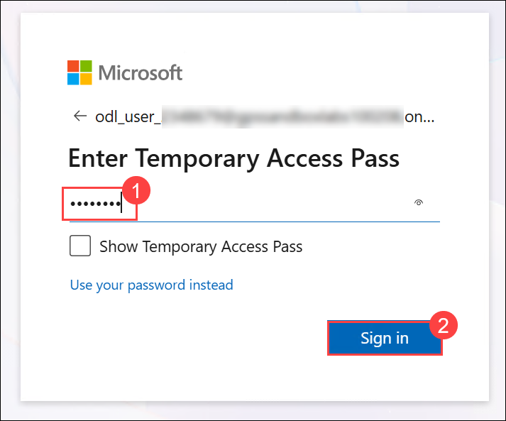

# Agent Cost Management in Microsoft 365 Copilot

### Overall Estimated Duration: 1 Hour 40 Minutes

## Overview

In this hands-on lab series, you will learn how to manage the full financial lifecycle of Microsoft 365 Copilot's usage-based billing model — from setting up a pay-as-you-go billing policy, to governing spend with Copilot Credits spending policies, to forecasting consumption before a rollout. Working as a tenant administrator, you will create and manage billing policies in the Microsoft 365 admin center, configure spending limits and alerts to prevent overspending, and use the Copilot Credit Estimator to build a defensible budget for Microsoft Copilot Studio and Dynamics 365 agents.

## Objective

The primary objective of this lab series is to give you hands-on, operational fluency with Microsoft 365 Copilot cost management. You will learn how to:

- Create a **Pay-as-you-go billing policy** from scratch — billing details, subscription, resource group, region, user scope, and an optional budget.
- Connect a Pay-as-you-go service to a policy, both during creation and afterward, and monitor organizational spend in the admin center and Microsoft Cost Management.
- Disconnect a service and delete a billing policy cleanly, understanding the full billing policy lifecycle.
- Activate the default **Copilot Credits spending policy** for your organization and understand which admin roles can perform each billing task.
- Create additional spending policies scoped to specific groups, with their own monthly limits, per-user limits, and usage alerts.
- Edit, disable, and delete spending policies, and predict which policy applies when a user belongs to more than one.
- Use the **Copilot Credit Estimator** to model low, medium, and high-volume usage scenarios and export a budget-ready PDF for stakeholder review.

## Lab Structure

This series is organized into three labs, each building your understanding of a different layer of Copilot cost management:

| Lab | Title | Focus |
| --- | --- | --- |
| **Lab 1** | Setting up and managing Pay-as-you-go billing in Microsoft 365 Copilot | Create, connect, monitor, and retire a Pay-as-you-go billing policy end to end. |
| **Lab 2** | Usage-based billing and Copilot Credits | Activate and scope Copilot Credits spending policies, configure limits and alerts, and understand policy precedence. |
| **Lab 3** | Estimate monthly Copilot Credit consumption for Microsoft Copilot Studio | Use the Copilot Credit Estimator to forecast usage and build a rollout budget. |

## Prerequisites

- A Microsoft 365 test/lab tenant with an Azure subscription available to associate with a billing policy.
- An account with the **Global administrator** or **Billing administrator** role (required for setting or changing billing methods in Labs 1 and 2).
- At least one security or distribution group in the tenant, for scoping policies to a subset of users.
- A web browser — Lab 3's Copilot Credit Estimator requires no sign-in or license.

> **Note:** Microsoft recommends using the role with the fewest permissions necessary for each task. The **Global administrator** role is highly privileged and should be used only when no other role can complete the task.

## Explanation of Components

- **Microsoft 365 admin center — Billing & usage:** Where Pay-as-you-go billing policies are created, connected to Copilot services, and retired.
- **Microsoft 365 admin center — Cost management:** Where Copilot Credits spending policies are activated, scoped, and monitored, including limits, alerts, and consumption dashboards.
- **Azure subscription:** Serves as the billing backbone for Pay-as-you-go Copilot Credit consumption.
- **Microsoft Cost Management:** Used alongside the admin center to monitor organizational spend against billing policies.
- **Copilot Credit Estimator:** A free planning tool that forecasts monthly Copilot Credit consumption for Copilot Studio and Dynamics 365 agents before you commit to a rollout.

## Getting Started with the lab

Welcome to your workshop. Let's begin by making the most of this experience:

## Accessing Your Lab Environment

Once you're ready to dive in, your virtual machine and **Guide** will be right at your fingertips within your web browser.

## Lab Guide Zoom In/Zoom Out

To adjust the zoom level for the environment page, click the **A↕ : 100%** icon located next to the timer in the lab environment.

## Virtual Machine & Lab Guide

Your virtual machine is your workhorse throughout the workshop. The lab guide is your roadmap to success.

## Exploring Your Lab Resources

To get a better understanding of your lab resources and credentials, navigate to the **Environment** tab.

## Utilizing the Split Window Feature

For convenience, you can open the lab guide in a separate window by selecting the **Split Window** button from the top right corner.

## Managing Your Virtual Machine

Feel free to **Start, Stop, or Restart (2)** your virtual machine as needed from the **Resources (1)** tab. Your experience is in your hands!

## Let's Get Started with the Microsoft 365 Admin Center

1. On your virtual machine, open a browser and go to the Microsoft 365 admin center.

2. You'll see the **Sign in to your account** tab. Here, enter your credentials:

   - **Email/Username:** <inject key="AzureAdUserEmail"></inject>

     

3. Next, provide your password:

   - **Password:** <inject key="AzureAdUserPassword"></inject>

     

4. If **Action required** pop-up window appears, click on **Ask later**.
5. If prompted to **stay signed in**, you can click **No**.

    

6. If a welcome or "take a tour" pop-up window appears, simply click **Cancel** or **Skip** to dismiss it.

## Support Contact

The CloudLabs support team is available 24/7, 365 days a year, via email and live chat to ensure seamless assistance at any time. We offer dedicated support channels tailored specifically for both learners and instructors, ensuring that all your needs are promptly and efficiently addressed.

Learner Support Contacts:

- Email Support: [cloudlabs-support@spektrasystems.com](mailto:cloudlabs-support@spektrasystems.com)
- Live Chat Support: https://cloudlabs.ai/labs-support

Happy learning!!
